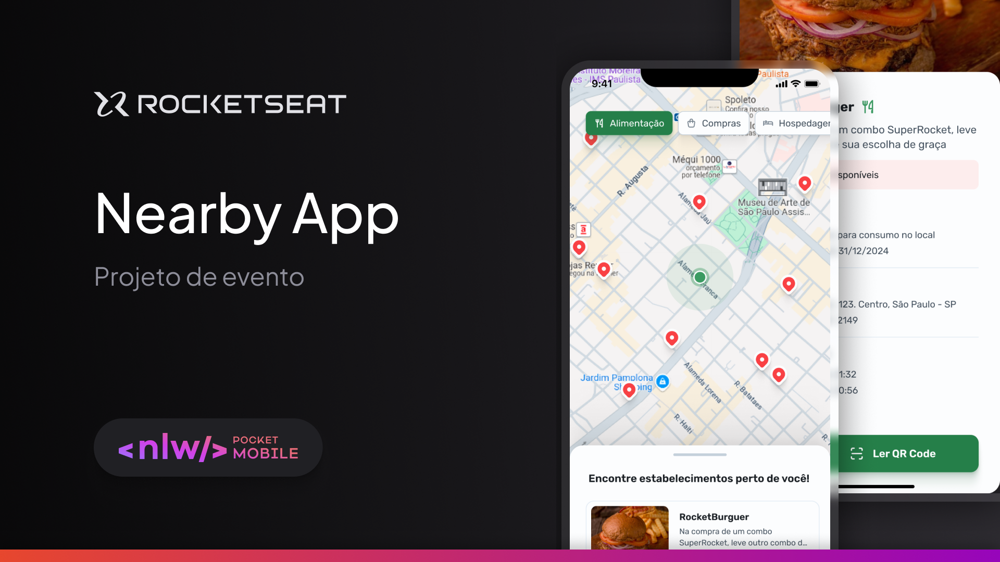
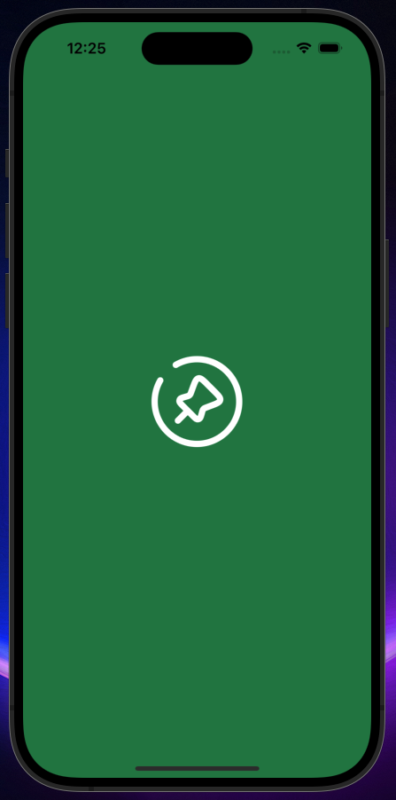
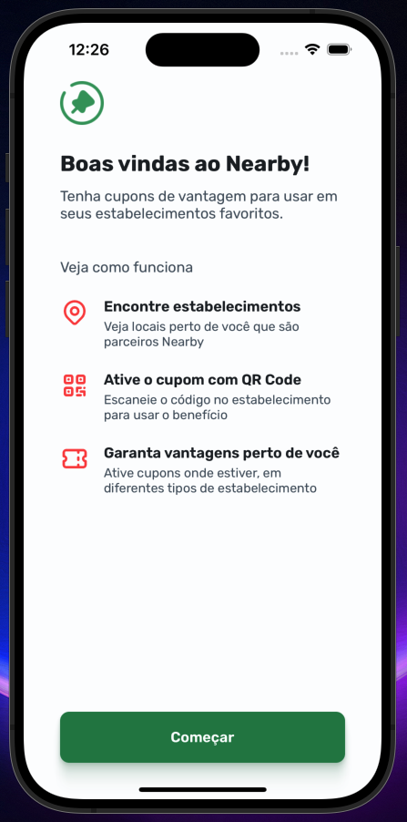
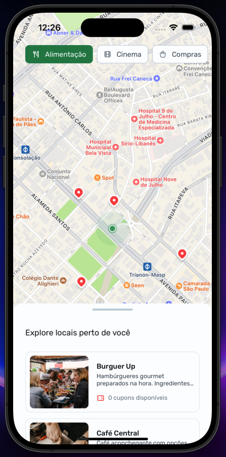
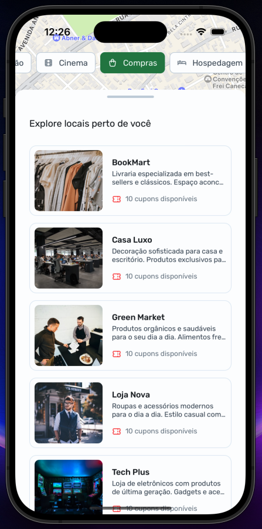
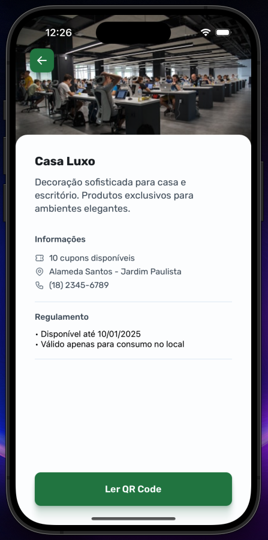

# Nearby

Project developed on Rocketseat's NLW Pocket: Mobile - React Native

**Nearby is an app for searching for discount coupons from establishments near the user, based on their current location.**

## 📋 Project information

- NLW Pocket: Mobile - React Native

## 🧠 Concepts learned

The development of this project aims to learn the following concepts:

- Integrate with an API
- Bottom Sheet implementation
- QR Code scanning with the camera
- Map render

## Views

| Splash screen                                           | Welcome                                           | Home                                        | Home with list expanded                                                      | Place Details                                           |
| ------------------------------------------------------- | ------------------------------------------------- | ------------------------------------------- | ---------------------------------------------------------------------------- | ------------------------------------------------------- |
|  |  |  |  |  |

## 🔗 Project Links

- 🎨 [**Figma**](https://www.figma.com/community/file/1448070647757721748)
- 📡 [**API repository on GitHub**](https://www.figma.com/community/file/1448070647757721748)

## 💻 Technologies

- React Native
- Expo
- TypeScript
- Expo Router
- react-native-maps
- expo-camera

## 📄 License

This project is licensed under the MIT License - see the [LICENSE](./LICENSE) file for more details.
